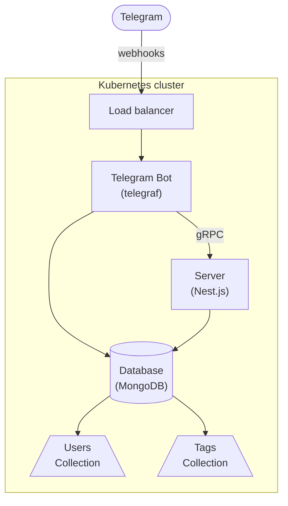
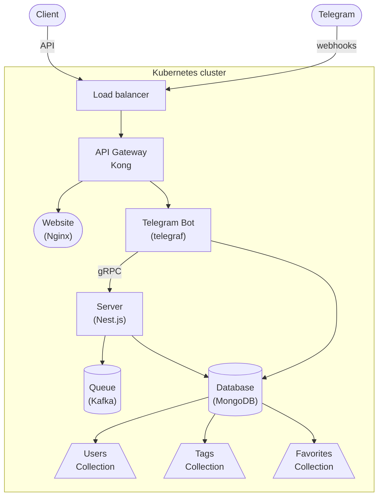

# Diagrams

## Current

```mermaid
graph TD

telegram(["Telegram"])

subgraph Kubernetes cluster
  lb["Load balancer"]
  bot["Telegram Bot\n(telegraf)"]
  server["Server\n(Nest.js)"]
  
  db[("Database\n(MongoDB)")]
  db_users[/Users\nCollection\]
  db_tags[/Tags\nCollection\]
end

db-->db_users & db_tags

telegram-->|webhooks|lb
lb-->bot
bot-->|gRPC|server
bot-->db
server-->db
```

## Complete

```mermaid
graph TD

telegram(["Telegram"])
client(["Client"])

subgraph Kubernetes cluster
  website(["Website\n(Nginx)"])
  lb["Load balancer"]
  gw["API Gateway\nKong"]
  bot["Telegram Bot\n(telegraf)"]
  server["Server\n(Nest.js)"]
  queue[("Queue\n(Kafka)")]
  
  db[("Database\n(MongoDB)")]
  db_users[/Users\nCollection\]
  db_tags[/Tags\nCollection\]
  db_favorites[/Favorites\nCollection\]
end

db-->db_users & db_tags & db_favorites

telegram-->|webhooks|lb
client-->|API|lb
lb-->gw-->website & bot
bot-->|gRPC|server
bot-->db
server-->db & queue
```
