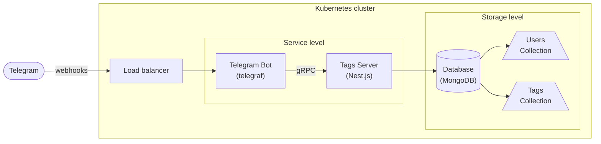
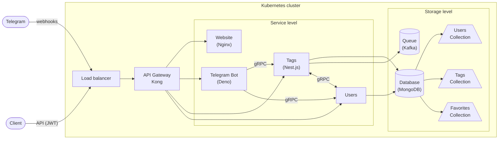

# Diagrams

## Current

```mermaid
graph LR

telegram(["Telegram"])

subgraph Kubernetes cluster
  lb["Load balancer"]
  
  subgraph Service level
    bot["Telegram Bot\n(telegraf)"]
    server["Tags Server\n(Nest.js)"]
  end
  
  subgraph Storage level
    db[("Database\n(MongoDB)")]
    db_users[/Users\nCollection\]
    db_tags[/Tags\nCollection\]
  end
end

db-->db_users & db_tags

telegram-->|webhooks|lb
lb-->bot
bot-->|gRPC|server
server-->db
```

## Complete

```mermaid
graph LR

telegram(["Telegram"])
client(["Client"])

subgraph Kubernetes cluster
  lb["Load balancer"]
  gw["API Gateway\nKong"]
  
  subgraph Service level
    website["Website\n(Nginx)"]
    bot["Telegram Bot\n(Deno)"]
    tags["Tags\n(Nest.js)"]
    users["Users"]
  end
  
  subgraph Storage level
    queue[("Queue\n(Kafka)")]
    db[("Database\n(MongoDB)")]
    db_users[/Users\nCollection\]
    db_tags[/Tags\nCollection\]
    db_favorites[/Favorites\nCollection\]
  end
end

db-->db_users & db_tags & db_favorites

telegram-->|webhooks|lb
client-->|"API (JWT)"|lb
lb-->gw-->website & bot & tags & users
bot-->|gRPC|tags & users
tags-->db & queue
users-->db
tags<-->|gRPC|users
```
